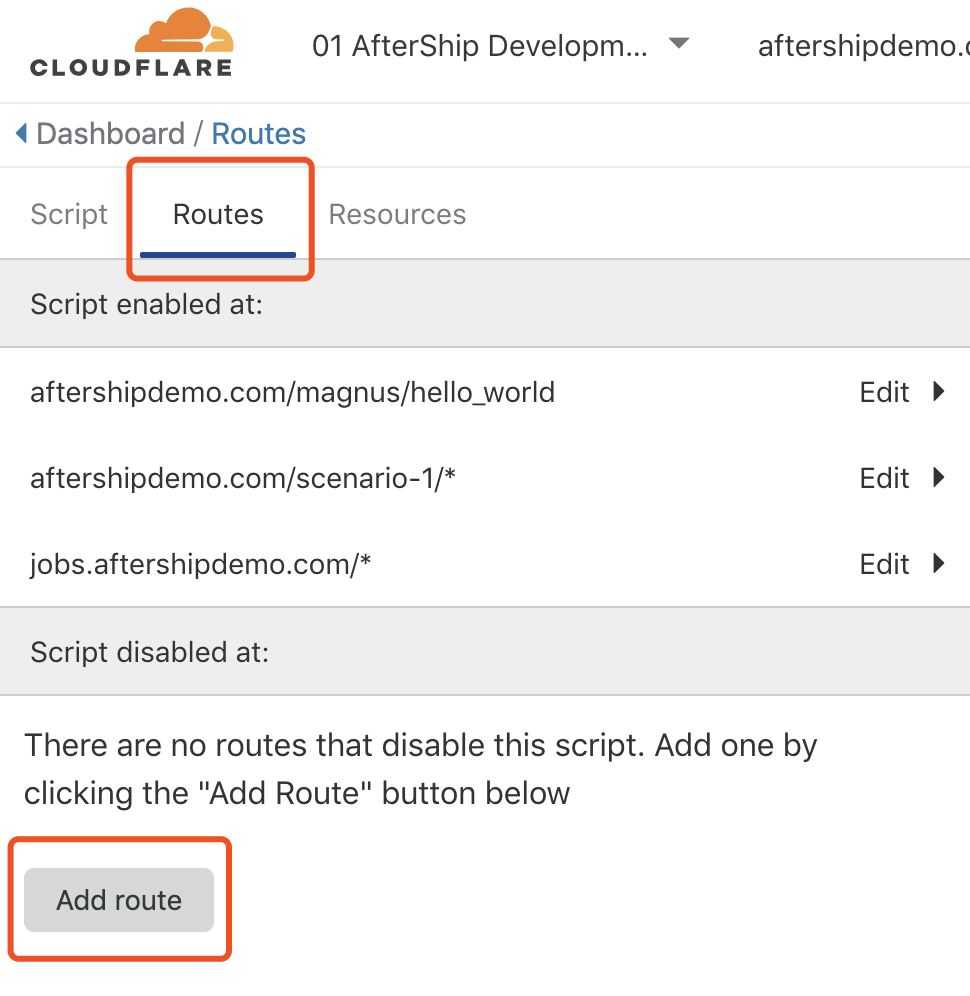
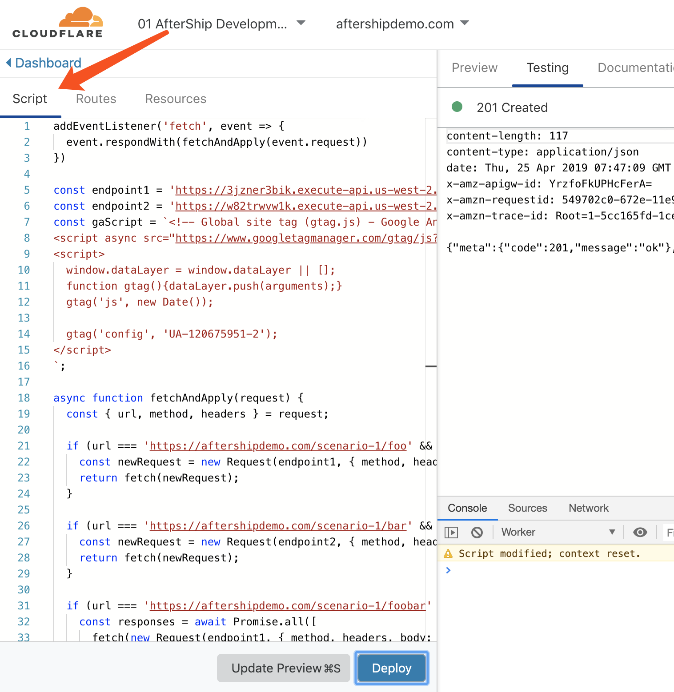
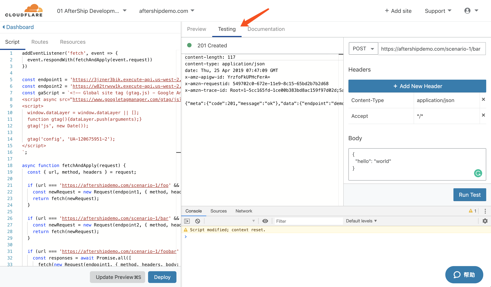

# demo-cloudflare-workers

demo code for cloudflare workers.

## Usage

First, clone this repo by running:

```bash
git clone git@github.com:AfterShip/demo-cloudflare-workers.git
```

The project has several branches for different scenarios we are going to demo. Just checkout to the target branch to see the demo code:

```
git checkout <target-branch>
```

Available branches:
- `aftership-serverless`
- `aftership-lagou-activity`

Log in to your cloudflare account, navigate to the tab `Routes`, add the path that you want to apply the script:



You may want to add routes for `demo{x}.aftershipdemo.com`.

Then navigate to the worker script editor, and paste the code into it:



Remember to modify the url used in the script to your own domain. you may change it to `demo{x}.aftershipdemo.com`.

Then click `Update Preview` to make the code available for testing.

Right to the script editor panel, that's an area for previewing. Navigate to the tab `Testing` and you can make custom requests here:



If your code behaves correctly, then you can click the `deploy` on the script editor panel to make your code really take effects.

Enjoy it :)
